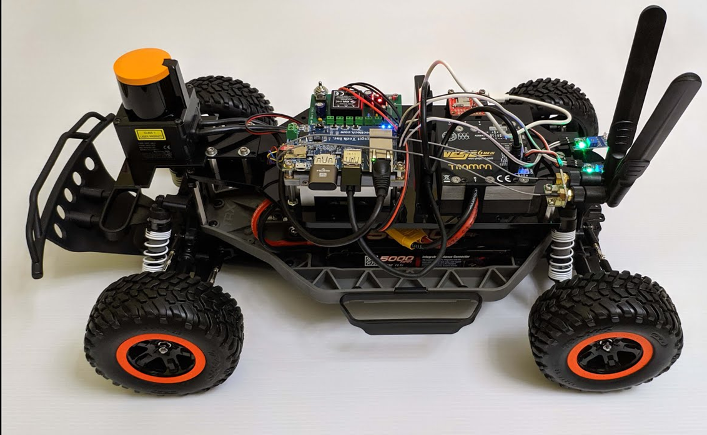

# SOMEThings Project Overview
The SOMEThings (**S**imulation **O**f **M**obility **E**cosystems & Internet of **T**hings) project was created with the intent of easing the process of building, testing, and deploying software in the real world. We wanted to create a cyber-physical smart ecosystem proving ground at [99P labs](https://developer.99plabs.io/home/) that would allow us and other teams to use it as a research platform. For a much more detailed look at the project, take a look at our [blog](https://medium.com/99p-labs/project-somethings-creating-a-cyber-physical-environment-for-the-future-of-mobility-979a1b9c4e55#23f1).

# Prerequisites
Everything in this repository assumes that you have followed the [F1TENTH Build documentation](https://f1tenth.readthedocs.io/en/stable/index.html) and have a car with all of the sensors configured and working properly. Aditionally, you should have Docker and docker compose installed on the car.

# The Car

We decided to use the [F1TENTH](https://f1tenth.org/) vehicle as our car and driver. This remote-controlled vehicle is an [Ackermann](https://en.wikipedia.org/wiki/Ackermann_steering_geometry) type vehicle, with the following sensors/hardware:
* ARM + GPU hardware
* LiDAR
* VESC/IMU
* Camera
* Ultrasonic
* Ultrawideband (UWB)

More detailed documentation on some of the sensors can be found in the [extra_sensor_documentation](/extra_sensor_documentation/) directory.

# Getting Started - Physical Car

1. **Turn on the car and build the images using `docker compose`**
    * Run `docker compopse up -d` from the [f1-docker](.) directory.
    * The [docker compose](docker-compose.yml) will build three images:
        * `nav`
        * `base`
        * `task_commander`
    * Every container includes a `ros_entrypoint.sh` file in the `/scripts` directory, which will do all of the sourcing and launch the relevant launch file(s).
        * If at any point you'd like to have the container start without automatically launching anything, you can replace the launch line with `sleep 99999999999999`.
    * You can visualize everything hapenning with the car using [RViz](https://github.com/ros2/rviz)
        * In our case, we simply navigate to `http://{car's_ip_address}:8080/`.
        * Once there, open `Terminator` and type in `rviz2`. This will launch a basic RViz window, without any of our predefined views.
        * To add a predefined view, run `ctrl + o` and select `Ubuntu/Documents/nav2_single_view_updated.rviz`.
2. **Go into the `nav` container to be able start executing commands**
    * You can get into any container by running *`docker exec -it {container_name} bash`*.
3. **Launch the nav2 stack by running *`ros2 launch car_navigation bringup_launch.py`* while still inside of the `nav` container.**
    * NOTE: To do this, you will first need to replace the launch line in the `ros_entrypoint.sh` file with `sleep 99999999999999` so that `bringup_launch.py` doesn't get automatically launched when the container boots up and you can instead manually launch it when you're ready and with whatever arguments you want.
    * If you haven't created a map yet, run *`ros2 launch car_navigation bringup_launch.py slam:=True`* instead. This will run [slam_toolbox's](https://github.com/SteveMacenski/slam_toolbox) `online_async_launch.py`. Drive the car around until you have a complete map and then save that map using *`ros2 run nav2_map_server map_saver_cli -f map_name_here`*. This will automatically created two new files:
        * **map_name_here.yaml:** contains metadata and the path to the image file
        * **map_name_here.pgm:** the actual image file with white, gray, and black pixels which represent the free, unknown, and occupied space on the map
    * Once the map is created, make sure to save the files in the `/maps` directory and change the value of the `map` parameter inside `bringup_launch.py` to match your map's name.
4. **Send the car a navigation goal using one of three options:**
    1. The easiest way to send goals is to use [RViz's](https://github.com/ros2/rviz) `Nav2 Goal` button for a single goal or `Waypoints / Nav Through Poses Mode` button for multiple goals.
        * Make sure you are pressing down the deadman switch (Right Bumper) otherwise the car won't move.
    2. You can also send a list of goal poses to the car using the `task_commander` container. Simply edit the `waypoints.csv` file inside the `/waypoints` directory and run *`ros2 launch f1_task_commander nav_through_poses_launch.py`* to have the car navigate through the poses listed in the file.
        * Note that the nav2 stack we launched in step 3 should still be running as the `task_commander` uses it for navigation. You can either open a new terminal for this or use *`tmux`*.
        * Make sure you are pressing down the deadman switch (Right Bumper) otherwise the car won't move.
    3. Submit a goal to the `/goal_pose` topic using *`ros2 topic pub`*
        * Make sure that you are using the correct message type and your values are formatted correctly.
        * Make sure you are pressing down the deadman switch (Right Bumper) otherwise the car won't move.

# Getting Started - Simulation
Detailed instructions are located in the [99P-Gym-Simulator repo](https://gitea-de.rke.az.platform.kotomatic.io/nsanthanam/99P-gym-simulator).

# Containers Overview

The car's functionality is broken up into a number of containers, with each container being responsible for a single general function of the car. These containers can all be ran, stopped, deleted, added, etc. independently of all of the other containers. This means that we can easily turn off any number of containers if we want to run a specific test and then just as easily turn them back on without every turning off the car.

# Deployment Architecture
The SOMEThings project utilizes containerization through Kubernetes, enabling application deployment and scalability using node clusters. In addition to this, all software updates are done through the [OTA process](https://medium.com/99p-labs/somethings-29a61ba50fd3). The combition of these two deployment architectures enables us to make quick and highly modular changes to the car's functionality, without having to restart the car for the changes to take effect.

# License
The SOMEThings Project is released under the [MIT License](https://opensource.org/license/MIT).